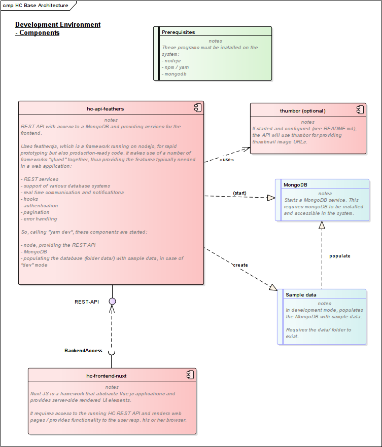

# Development Environment

For prerequisites and setup of API and frontend, please see those pages:

* [Server API / Feathers](../server-api/installation.md)
* [Frontend / Nuxt](../web-app/installation.md)

Here's a graphical overview of how the components in the development environment are connected.


<object data="../assets/development_env.png" type="image/png">

</object>

