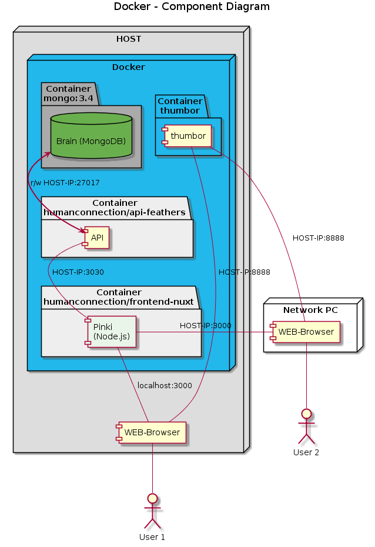

# Docker

The components of the Human Connection runtime are configured to run in Docker containers.

The Docker images are used for testing and production environments.

Here's an overview:


<object data="../assets/test_production_env_docker.png" type="image/png">

</object>
