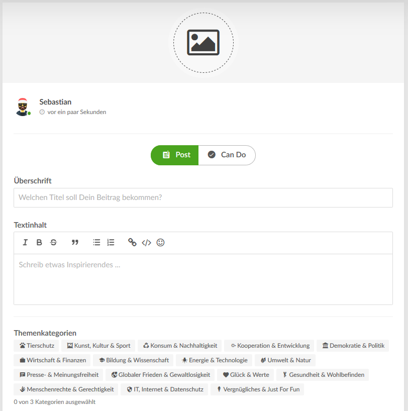

## Post Builder ##

Posts (contributions) can be build using the Quill editor or plain text. Each post can be filled with different content
elements like embeds, videos, images, lists, paragraphs, headings, gallery, polls and many more. 

Current stage of the Feature: As of now we have 2 types of posts **post** and **can do** as shown in the image below.
In the future we want to change this by moving "can do" to the list of content elements.

 

The Post builder should be easy to understand and work with for non-tech users. Quill is the current WYSIWYG
editor implemented and it's toolbar can be customized.